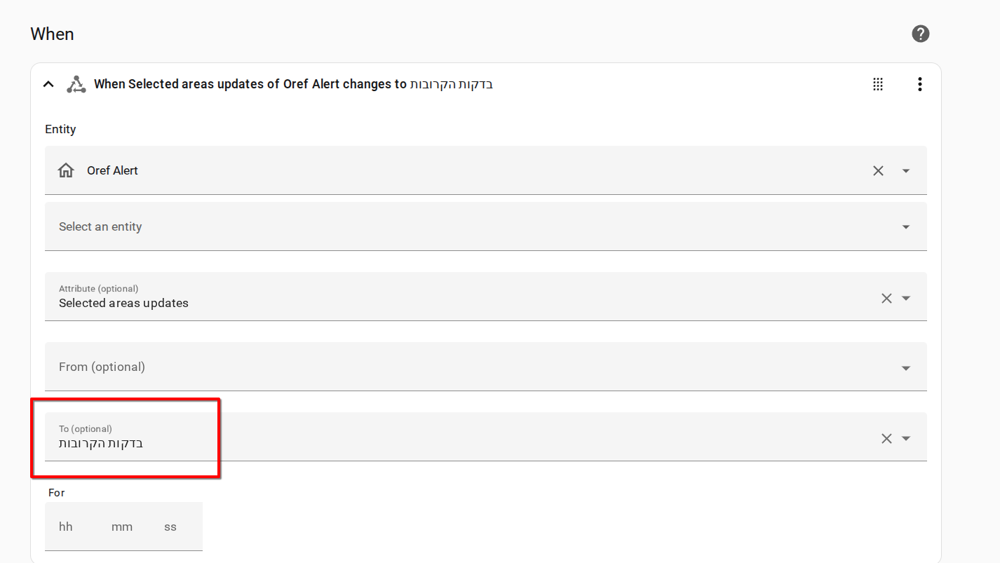
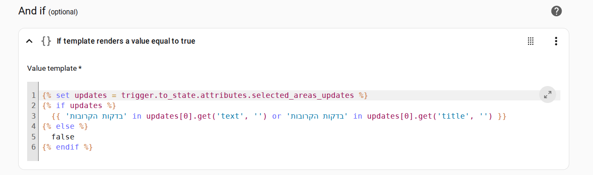
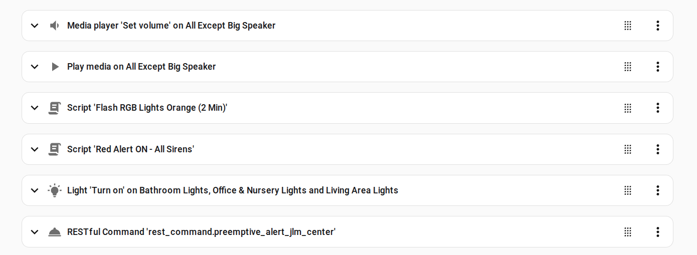

# Red Alert HA Template - Updated Automation Templates

Posted: 17-Aug-2025

This repository provides updated templates for running automations in Home Assistant based on trigger conditions in the [Oref Alert](https://github.com/amitfin/oref_alert) integration which, in turn, provides red alerts as issued by Pikud HaOref (Home Front Command) and makes them available in Home Assistant. 

## Updated "Preemptive Alert" (2025-)

The Home Front Command has made several updates to its civilian alerting system during the course of 2025.

In the face of ongoing rocket attacks from the Houthis in Yemen, during early 2025, the IDF began to issue "preemptive alerts". 

These alerts are understood to be probablistic in nature: They provide citizens with a few minutes extra notice on the understanding that an active alert will probably trigger in their area, affording citizens several more minutes of preparedness during the middle of the night (and in general). 

It is believed that the alerting is based upon the probable geolocations of rockets and/or shrapnel falls. However since these trajectories are complex to plot especially before an interception point is established, the alerting tends to follow a wide-narrow pattern (wide preemptive alerts, narrower active "red alerts"). Hence preemptive alerts are not always followed by "red alerts."

## Updated Alerting During Iran-Israel War 2025

The Iran Israel War of June 2025 brought Israel into a state of national emergency with alerting conditions changed (or devised!) to reflect the new threat environment.  

These alerts followed a fairly standardised pattern enabling a reasonable degree of success in translating the JSON payloads into useful automations. 

These alerts included (Hebrew):

 | שלב | טקסט מקור בעברית |
|------|--------------------|
| **שלב מקדים – הישאר סמוך למרחב המוגן** | יש לשהות סמוך למרחב המוגן |
| **כ-10 דקות לפני** | בדקות הקרובות צפויות התרעות באזורך, שפר מיקומך למיגון המיטבי באזורך |
| **כ-1.5 דקות לפני – הכניסה למרחב מוגן** | היכנסו למרחב המוגן |
| **סיום ישיבה במרחב – ניתן לצאת אך להישאר בקרבה** | ניתן לצאת מהמרחב המוגן אך להישאר בסמיכות אליו |
| **סיום מוחלט – מרחב מוגן לא נדרש עוד** | ניתן להתרחק מהמרחב המוגן מעבר לטווח של דקה וחצי הגעה אליו |

The premptive alerts, which were introduced as a separate event class in the integration, were hastily replaced by these new "status update" messages. This change has persisted through to the time of writing. 

`preemptive-alert.yaml` provides an automation template which runs a keyword match for the new preemptive alert class on the user's alerting location (ie, `binary_sensor.oref_alert`)

## Using RGB Lights For Status Indication

I use "turn all the lights on" as my go-to "action" for red alert automating. This has proven extremely effective. If the lights all randomly go on ... an alert is happening (or about to happen).

To provide specificity, I use RGB light bulbs (Zigbee) and have them turn orange for preemptive alerts, green for all clear and red for active.

The scripts for triggering these light conditions are provided in `flashing-lights.` I simply create a light group with the RGB-capable lights I want to use with the Red Alert automations.
